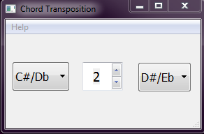

# 1. Description. 

This simple Chord Transposer allow to transpose chord or count the
intervals between two chords. The code is in python 3 and pyqt5
library for the user interface.

This is a snapshot of the user interface: 

